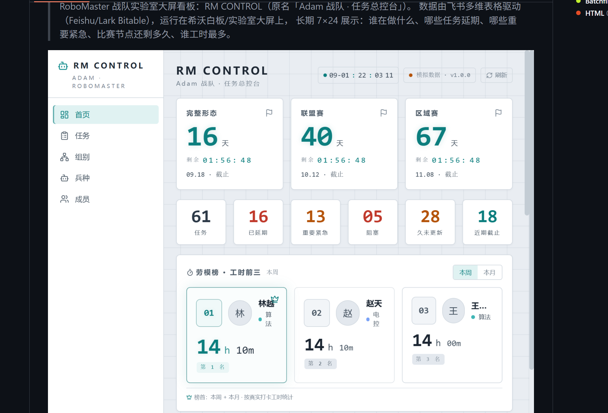

# RM CONTROL — RoboMaster 战队任务总控台

> RoboMaster 战队实验室大屏看板：RM CONTROL（原名「Adam 战队 · 任务总控台」）。
> 数据由飞书多维表格驱动（Feishu/Lark Bitable），运行在希沃白板/实验室大屏上，
> 长期 7×24 展示：谁在做什么、哪些任务延期、哪些重要紧急、比赛节点还剩多久、谁工时最多。



本项目是一个**轻量、易部署、Windows 可运行**的战队 Dashboard：后端 Flask + 前端 React
静态站。数据源是飞书多维表格（任务）、飞书考勤/工时表（劳模榜）与飞书通讯录（头像），
可选的工业相机 + 人脸识别用于战队成员签到。

其他 RoboMaster 队伍 clone 后，**主要只需要修改两份配置**（`backend/.env` 与
`backend/config/team.yaml`）即可运行，无需修改源代码——品牌名、组别、兵种、别名都
通过 `team.yaml` 配置。

---

## 目录

- [界面长什么样](#界面长什么样)
- [主要功能](#主要功能)
- [架构](#架构)
- [快速启动（Quick Start）](#快速启动quick-start)
- [飞书配置](#飞书配置)
- [队伍配置 team.yaml](#队伍配置-teamyaml)
- [摄像头可选功能](#摄像头可选功能)
- [开发方式](#开发方式)
- [部署方式](#部署方式)
- [FAQ](#faq)
- [Legacy：Windows 7 部署](#legacywindows-7-部署)
- [License](#license)

---

## 界面长什么样

左侧固定导航 + 右侧内容区：

```
┌────────────┬────────────────────────────────────────────┐
│ RM CONTROL │  🕐 09-01 22:03 11   ● 模拟数据 · v1.0   [刷新] │
│ ADAM ·     │  ────────────────────────────────────────── │
│ ROBOMASTER │  [完整形态 16天] [联盟赛 40天] [区域赛 67天] │
│            │  ────────────────────────────────────────── │
│ ■ 首页      │  61任务 │ 16延期 │ 13重要紧急 │ 05阻塞 │ 28久未更新 │ 18近期截止 │
│ □ 任务      │  ────────────────────────────────────────── │
│ □ 组别      │  劳模榜 · 工时前三（本周/本月切换）          │
│ □ 兵种      │  [① 林越 算法 14h10m] [② 赵天 电控 14h10m] … │
│ □ 成员      │  …                                         │
└────────────┴────────────────────────────────────────────┘
```

顶部三张倒计时卡（完整形态 / 联盟赛 / 区域赛）、一行统计卡（任务/延期/重要紧急/阻塞/
久未更新/近期截止）、劳模榜（工时 + 点赞加权）。

---

## 主要功能

- **首页（Dashboard）**：比赛节点倒计时（完整形态/联盟赛/区域赛）、任务统计、劳模榜、值日、今日历史文档。
- **任务页**：按剩余时间排序的进行中任务，截止日期越近红色越深、闪烁越快，逾期加重提示。
- **组别页**：按队伍配置的组别聚合统计（组别/别名完全可配置）。
- **兵种页**：按兵种聚合统计（步兵/重装/哨兵/雷达/飞镖，可配置合并）。
- **成员页**：成员工时排行、在办任务。
- **劳模榜**：工时 + 点赞加权排行（点赞权重可配置），总工作时长统计。
- **值日表**：按名单轮值生成今日 + 未来 6 天。
- **今日历史文档**：随机抽取飞书云盘文档预览（只读，不编辑不删除）。
- **摄像头人脸签到**（可选）：YuNet 检测 + SFace 深度特征识别，支持陌生人拒识、
  低频识别、多帧确认、身份缓存；签到结果同步到飞书。
- **宣传片循环播放**：首页一键全屏循环播放宣传片（双击退出），支持深色模式、防烧屏像素偏移。

---

## 架构

```
浏览器（希沃大屏 / 笔记本 / 手机）
      │
      ▼
  Waitress (TCP 8080, 生产 WSGI)
      ├── /        → React 静态站点（frontend 构建产物仓库根 dist/）
      └── /api/*   → Flask API
                        │
                        ├── 飞书多维表格（任务数据，唯一 Source of Truth）
                        ├── 飞书考勤/工时表（劳模榜，可选）
                        ├── 飞书通讯录（人员头像，12h 缓存）
                        ├── 飞书云盘（今日文档，只读）
                        └── 工业相机 + 人脸识别（可选，签到）
```

```
repo/
├─ backend/                  Flask 后端
│  ├─ app.py                 入口：/api/* + 静态站点 + Waitress 启动
│  ├─ requirements.txt       核心依赖（Dashboard / 飞书 / Flask）
│  ├─ requirements-camera.txt 摄像头/人脸识别（可选依赖）
│  ├─ .env.example           环境变量模板（复制为 .env）
│  ├─ config/
│  │  ├─ team.example.yaml   队伍配置模板（组别/兵种/别名，复制为 team.yaml）
│  │  ├─ duty.py             值日名单/起始日（或 duty.yaml）
│  │  ├─ featured_docs_example.py  今日文档示例（真实 featured_docs.py 不入库）
│  │  └─ ...
│  ├─ services/              数据源聚合（sources）、飞书 client、工时、签到同步
│  ├─ integrations/camera/   摄像头模块（采集/预览/识别/人脸库，可选）
│  ├─ data/                  Mock 演示数据（任务/工时）
│  └─ tests/                 后端测试（pytest）
├─ frontend/                 React + Vite + TypeScript
│  └─ src/                   api client / store / 页面 / 组件
├─ scripts/                  启动、部署脚本（PID 文件方案，不杀全部 python）
├─ examples/deployment/      实验室特定部署示例（虚构 IP）
└─ docs/screenshots/         截图
```

---

## 快速启动（Quick Start）

环境要求：**Python 3.11+**、**Node.js LTS**（仅构建前端时需要）。推荐 Windows 10/11 或 Ubuntu 22.04/24.04。
Windows 7 / Python 3.8 见 [Legacy 章节](#legacywindows-7-部署)。

### 方式 A：一键脚本（推荐）

**Windows (PowerShell)**
```powershell
git clone https://github.com/kswlt/Lark_vision.git
cd Lark_vision
.\scripts\setup.ps1     # 创建 .venv、装依赖、build 前端、复制 .env/team.yaml
.\scripts\start.ps1     # 启动（PID 管理）
# 浏览器打开 http://localhost:8080
# 停止：.\scripts\stop.ps1
```

**Ubuntu / Linux**
```bash
git clone https://github.com/kswlt/Lark_vision.git
cd Lark_vision
chmod +x scripts/*.sh
./scripts/setup.sh      # 创建 .venv、装依赖、build 前端、复制 .env/team.yaml
./scripts/start.sh      # 启动（nohup + PID）
# 浏览器打开 http://localhost:8080
# 停止：./scripts/stop.sh
```

脚本会自动创建 `.env`（默认 `DATA_SOURCE=mock, CAMERA_ENABLED=false`），首次启动即可看到完整 Dashboard，不需要飞书账号。

### 方式 B：手动步骤

<details>
<summary>Windows（PowerShell）</summary>

```powershell
git clone https://github.com/kswlt/Lark_vision.git
cd Lark_vision

python -m venv .venv
.\.venv\Scripts\Activate.ps1
python -m pip install -r backend\requirements.txt

Copy-Item backend\.env.example backend\.env
Copy-Item backend\config\team.example.yaml backend\config\team.yaml

cd frontend
npm ci --legacy-peer-deps
npm run build          # 产物输出到 ../dist/
cd ..

python backend\app.py
# 浏览器打开 http://localhost:8080
```
</details>

<details>
<summary>Ubuntu / Linux</summary>

```bash
git clone https://github.com/kswlt/Lark_vision.git
cd Lark_vision

python3 -m venv .venv
source .venv/bin/activate
python -m pip install -r backend/requirements.txt

cp backend/.env.example backend/.env
cp backend/config/team.example.yaml backend/config/team.yaml

cd frontend
npm ci --legacy-peer-deps
npm run build          # 产物输出到 ../dist/
cd ..

python backend/app.py
# 浏览器打开 http://localhost:8080
```
</details>

### 默认访问与端口

- 本机：`http://localhost:8080`
- 同局域网：`http://<本机IP>:8080`（Windows 防火墙 / Ubuntu ufw 需放行 TCP 8080）
- 修改端口：编辑 `backend/.env` 里的 `PORT` / `HOST`
- 首次演示保持 `DATA_SOURCE=mock`，确认页面正常后再切 `DATA_SOURCE=feishu` 接真实飞书数据。

---

## 飞书配置

1. 在 [飞书开放平台](https://open.feishu.cn/app) 创建企业自建应用，开通权限：
   - `多维表格：查看`（bitable:app:readonly）
   - `通讯录：获取用户基本信息`（contact:user.base:readonly）
   - （劳模榜需要时）`考勤：导出打卡数据` 或 多维表格工时表权限
   - （今日文档需要时）云文档只读权限
2. 获取 `App ID` / `App Secret`，以及任务多维表格的 `App Token` / `Table ID`。
3. 填入 `backend/.env`（**不要提交 .env 到 Git**）：

```dotenv
DATA_SOURCE=feishu
FEISHU_APP_ID=cli_xxxxxxxx
FEISHU_APP_SECRET=xxxxxxxx
FEISHU_APP_TOKEN=xxxxxxxxxxxxxx
FEISHU_TABLE_ID=tblxxxxxxxx
FEISHU_WORKTIME_SOURCE=mock   # bitable | attendance | mock
ADMIN_TOKEN=change-me-strong-random-token
```

4. 重启后端。访问 `http://localhost:8080/api/health` 确认：

```json
{
  "status": "ok",
  "data_source": "feishu",
  "feishu": "ok",
  "last_success_sync": "2026-09-15T10:00:00",
  "cache_age": 12,
  "stale": false
}
```

### 数据源模式（重要）

- `DATA_SOURCE=feishu`（默认）：连接真实飞书。**飞书请求失败时返回最近一次成功缓存并标记
  `stale: true` / `status: degraded`**；从未成功过则返回明确空态/错误，**绝不自动生成 Mock 假数据**。
- `DATA_SOURCE=mock`：演示数据，用于开发与开源演示。

前端顶部状态条会显示数据源与「正在显示缓存数据」提示，不会把过期数据伪装成实时数据。

### 任务表字段约定

任务多维表格需要以下字段（名称可在 `backend/config/feishu_fields.py` 调整）：

| 字段 | 说明 |
| ---- | ---- |
| 任务标题 / 标题 | 任务名（必填） |
| 负责人 / 成员 | 任务负责人（可选） |
| 所属组 / 组别 | 映射到组别（别名见 team.yaml） |
| 兵种 / 车型 | 映射到兵种（别名见 team.yaml） |
| 优先级 | 超紧急限时 / 重要紧急 / 重要 / 一般（可别名） |
| 开始日期 / 截止日期 | 任务时间（用于剩余天数与逾期提示） |
| 状态 | 进行中 / 已完成 / 停滞 / 已停止（只有进行中显示在任务页） |

---

## 队伍配置 team.yaml

复制 `backend/config/team.example.yaml` 为 `backend/config/team.yaml` 后修改：

```yaml
team:
  name: RoboMaster Team          # 前端品牌名（大屏左上角）
  groups: [算法, 电控, 机械, 运营]   # 组别（组别页 / 任务编号前缀）
  robots: [重装, 步兵, 哨兵, 雷达, 飞镖]  # 兵种（兵种页）
  group_aliases:                 # 飞书里出现的组别叫法 -> 正式组别
    视觉: 算法
    视觉组: 算法
  robot_aliases:                 # 飞书里出现的兵种叫法 -> 正式兵种
    英雄: 重装
    工程: 重装
    步兵1: 步兵
  group_prefixes:                # 任务 fallback 编号前缀
    算法: ALG
    电控: ELE
  priority_map:                  # 优先级文字 -> 内部枚举
    超紧急限时: super_urgent
    重要紧急: important_urgent
    重要: important
    一般: normal
```

- **不创建 `team.yaml` 时使用内置默认值**（与示例一致），后端日志会提示复制示例文件。
- 修改后重启后端生效；前端通过 `GET /api/meta` 读取，无需改 TypeScript 源码。

---

## 摄像头可选功能

摄像头 + 人脸签到是**可选功能**。未安装任何相机依赖时 Dashboard 照常运行
（`CAMERA_ENABLED=false`，人脸签到入口自动隐藏/禁用）。

```bash
pip install -r backend/requirements-camera.txt
```

在 `backend/.env` 中启用：

```dotenv
CAMERA_ENABLED=true
CAMERA_CTI_PATH=C:\Program Files\HuarayTech\...\GenTL_Python\xxx.cti
```

- **检测**：YuNet ONNX（`backend/integrations/camera/models/`）
- **识别**：OpenCV SFace 深度人脸特征（`cv2.FaceRecognizerSF_create`）
  - Gallery 向量库 + 余弦相似度 + 阈值/边距双重判定，**严禁强制 Top-1**；
  - 陌生人拒识（不在数据库中），多帧确认 + 身份缓存，低频识别（约 1~3 FPS），
    预览保持在 20 FPS 以上。
- **人脸库**：`backend/face_library/`（每人至少 1 张清晰照片即可注册，支持多张）。
- **华睿 SDK**（harvesters/genicam）无法通过 pip 安装，需安装官方「华睿 MV Viewer」，
  并在 `CAMERA_CTI_PATH` 指向其 GenTL CTI 文件。其他 USB 摄像头可通过 OpenCV
  VideoCapture 使用（见 `integrations/camera/base.py`）。

> 本机无相机时，人脸识别的真实运行请标注「需要真实硬件验证（希沃端）」。

---

## 开发方式

```bash
# 后端（热重载开发服务器）
cd backend
python app.py            # 默认 Waitress :8080；开发可用 FLASK_DEBUG=1

# 前端
cd frontend
npm ci --legacy-peer-deps
npm run dev              # Vite dev server :5173，/api 代理到 :5000（按需修改 vite.config.ts）
```

### 测试与质量

```bash
# 后端
python -m compileall backend
ruff check backend
pytest backend

# 前端
cd frontend
npm run lint
npm run test
npm run build
```

前端已配置 ESLint（flat config）+ Prettier + Vitest；后端已配置 ruff + pytest。
CI（GitHub Actions）不依赖真实飞书账号、相机、Secret 与网络。

---

## 部署方式

### 本机 / 服务器（推荐现代系统）

```bash
pip install -r backend/requirements.txt
DATA_SOURCE=feishu ADMIN_TOKEN=xxx python backend/app.py
```

生产使用 **Waitress**（线程池 WSGI），不需要 Nginx 即可单机对外。

### 脚本部署（可选）

| 用途 | Windows | Linux |
|------|---------|-------|
| 初始化 | `.\scripts\setup.ps1` | `./scripts/setup.sh` |
| 启动 | `.\scripts\start.ps1` | `./scripts/start.sh` |
| 停止 | `.\scripts\stop.ps1` | `./scripts/stop.sh` |
| 远程推送 | `.\scripts\deploy.ps1 -Host <IP> -User <user> -Key <ssh_key>` | （暂无 deploy.sh） |

脚本均使用 PID 文件精确管理，不会 `taskkill /f /im python.exe` 误杀其它进程。

### 长期运行

**Windows（开机自启）**：用 `scripts\start.bat` 配合 Windows「任务计划程序」设置开机启动即可。
历史 Win7 方案见 [Legacy](#legacywindows-7-部署)。

**Linux（systemd）**：参考 `examples/deployment/systemd/rm-control.service.example`：

```bash
sudo cp examples/deployment/systemd/rm-control.service.example /etc/systemd/system/rm-control.service
# 编辑文件：把 /path/to/Lark_vision 改成实际路径，User 改成实际用户
sudo systemctl daemon-reload
sudo systemctl enable --now rm-control
journalctl -u rm-control -f   # 看日志
```

生产使用 **Waitress**（Windows）/ Waitress 也可在 Linux 运行，不需要 Nginx 即可单机对外。

---

## FAQ

**Q: 页面显示「正在显示缓存数据」？**
后端飞书请求失败，正在展示最近一次成功缓存（`/api/health` 中 `stale=true`）。
请检查 `backend/.env` 凭证与网络；这不是 Mock 假数据。

**Q: 为什么 tasks 是空的 / 报「DATA_SOURCE=feishu 但未配置…」？**
`DATA_SOURCE=feishu` 但 `backend/.env` 未填写飞书凭证。复制 `.env.example` 并填写，
或开发时显式 `DATA_SOURCE=mock`。

**Q: 怎么改组别/兵种？**
改 `backend/config/team.yaml` 的 `groups` / `robots` / 别名，重启后端即可。

**Q: 摄像头不工作？**
确认 `CAMERA_ENABLED=true`、`CAMERA_CTI_PATH` 指向有效 CTI、已安装
`requirements-camera.txt`。日志中查看 `camera` 模块初始化信息。

**Q: 前端改了代码看不到效果？**
`npm run build` 后产物输出到仓库根目录 `dist/`，刷新浏览器（必要时强制刷新）。

**Q: 支持哪些浏览器？**
现代 Chrome/Edge 均可；希沃端建议 Chrome，详见 Legacy 章节。

---

## Legacy：Windows 7 部署

本项目最初运行在实验室希沃白板（Windows 7 老双核、Python 3.8），此路径**仍受支持**，
但仅建议旧设备使用：

- 使用 **Python 3.8**（仓库历史提供 `installers/` 的 3.8 安装包说明，安装包不入库）。
- 后端依赖锁定在 `requirements.txt`（Flask 2.3.3 / waitress 3.0 / requests 2.31，兼容 Win7）。
- 前端在开发电脑（现代 Node）构建出 `dist/`，Win7 只运行 Python 服务。
- Win7 无安全更新，**仅限实验室内网使用，不建议暴露公网**；摄像头人脸识别在
  老双核上建议保持「低频识别 + 多帧确认」，预览 ≥20 FPS。
- 摄像头 SDK（华睿）按厂商要求安装在希沃端，`CAMERA_CTI_PATH` 指向实际路径。

---

## License

[MIT](./LICENSE)
